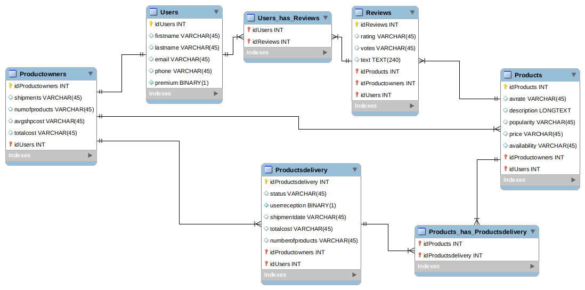
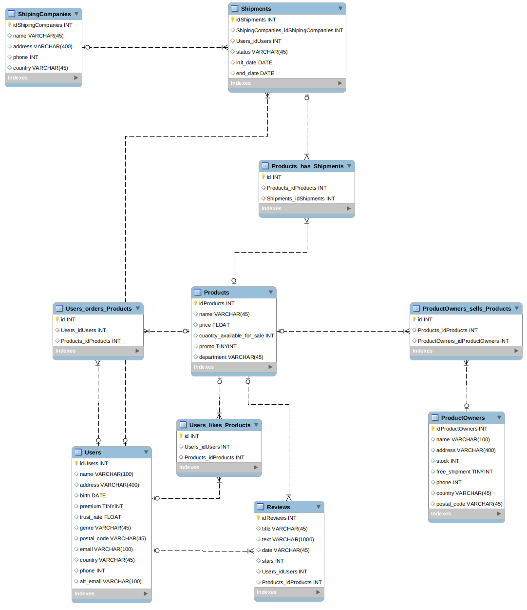

# Day 3, Proyecto SQL - base de datos para AMAZON
_____
## Step 1
First, I create a Database for AMAZON. Main duties are:
 
* Store Users account information:
    * Name (First and Last)
    * Email
    * Phone
    * Does the user have a Premium Account?
* Store Users relation with Reviews
* Store Reviews information:
    * Rating (Given by other users to each Review obtaining the overall)
    * Votes (Number of votes from other users to each Review)
    * Review body text
* Store Productowners info:
    * Shipments (Number of shipments)
    * Total amount of products buyed by the Productowner
    * Average Shipment spent for the Productowner
    * Total amount of money spent by the Productowner
* Store Products delivery information:ç
    * Status
    * User reception confirmation
    * Shipment date departure
    * Total Cost
    * Number of products
* Products:
    * Average Rate given by users
    * Description body text
    * Popularity (Relation between number of orders in the last month and Avg rating given by the users)
    * Product cost
    * Availability
* Store Products relation with Products Deliveryhow to see
____
Final **Entities** to satisfy the requirements for this Project:
* Users
* Reviews
* Products
* Productsdelivery
* Productowners 
 
In the following **ERD DIAGRAM**, saved as *iteration1.png* we can see the entities and the relationships between them (ERD are described in **Step 2**).  

_____
## Step 2
### ERD configuration
Relation One to One:
* **Users** can only have one **product owner** and vice versa
 
Relation One to Many: 
* Productsowners with Productsdelivery
    * One **product owner** can have more than one **shipment** but one **shipment** can only have one **product owner**
* Productsowners with Products
    * One **product owner** can have more than one **product** but one **product** can only have one **product owner**
* Products with Reviews
    * One **product** can have more than one **review** but one **review** can only have one **product**
 
Relation Many to Many:
* Users with Reviews
    * One **user** can have more than one **review** and one **review** can have at the same time the valoration of more than one **user**
* Products with Productsdelivery
    * One **product** can appear in more than one **shipment** and one **shipment** can have more than one **product**
 
Finally, I export the ERD as a SQL script called as *iteration2.sql*
_____
## Step 3
Añado la entidad Billinginfo con los siguientes attributos:
* name, lastname, adress, city, country, zip, contactphone, bankaccount
 
This entity is has an ERD One to One with Users Entity 
Export the new ERD as a SQL script called *iteration3.sql* 
_____
## Step 4
Beliving that the ERD diagram and data base is normalized I procced to 
attach the final screenshot of the database as *iteration4.png* 

_____
## FINAL COMMENTS
I have found the following issues: 
* At the beginning, I have found hard to define Foreign keys. Once understood the nomenclature I did not have any problem with them.
* Relations Many to Many. What to do with the Entities created to help in the relation. Do they need a primary key to identify each register or can be filled without any primary and unique key?
 
### Thank you very much for your feedback
### Ivan Cernicharo Ortiz, Data Analytics Bootcamp at IronHack