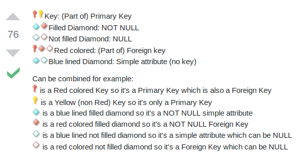
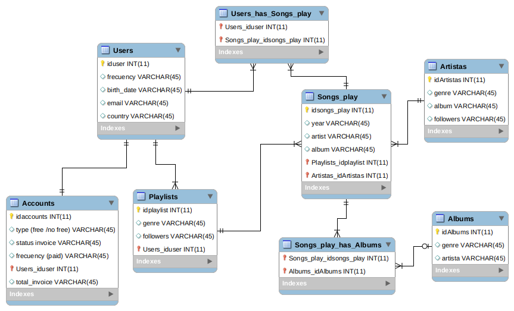

# Process to create a workbench diagram to define the business operation model

## Amazon

### In Paper:

1. A first sketch of the model was created in a piece of paper

### In Workbench:

2. Once the different entities and the relationships between them made sense, the sketch was translated into a diagram in MySQL Workbench, for this:

* From MySQL Workbench's file menu, select new model and once the model is created select "Add Diagram"

* Entities (tables) and their attributes (columns) are defined. When creating entities, a primary key is always defined in order to ensure the uniqueness of registers within the table. The type of register (INT, VARCHAR, ETC) should be defined for each individual attribute.

* Link the different entities using relationships laces that define one to one, one to many or many to many relatioships as necessary.

* When lacing, foreign keys will be generated automatically by workbench, however it is observed that these automated keys do not always match our schema. In the Amazon model that has been created, all foreign keys must also be primary keys to ensure uniqueness in origin and to define identifying relationships. The image below will clarify the nature of different attributes.

 

it is also important to note that identifying relationships (this are defined as continous lines within Workbech) define strong relationships where a foreign key should also be primary key and whose value cannot be null. These relationships mean that a child entity cannot exist without the parent entity ; Non-identifying relationships (discontinous lines within Workbench) will define weak associations, meaning that the foreign key doesn't have to be primary and could have a null value; Moreover, the child entity could exist without the parent entity.

3. The logic of the Amazon diagram in this example lies on the relationship that the entity order has with the rest of entities. At the end, Amazon is a marketplace which aims to generate as many orders as possible.

* A user(entity) could generate several orders, however each of the orders will be associated with just one user(one to many). Such order could contain several products and at the same time the products in one order can also exist in a different order(many to many). Such products are sold by a seller who could have several products on sale. Moreover, products could be sold by several sellers (many to many). Once a user complete an order, this order will generate a unique delivery, and such delivery is associated just with one order(one to one). Once the order is received by the user, amazon will request the user to leave a review in the web, an order could generate as many reviews as product contains, however a specific review is associated with just one order (one to many). At the same time, a specific product can be reviewed several times as a consequence of its presence in several orders, however a review is specific to one product (one to many). 

#### Iteration 1 was produced at this point by taking an snapshot of the diagram

#### Iteration 2 was produced at this point from Workbench<Database<ForwardEngineer...Saving to file

4. The inclusion of the invoice entity was made after the whole logic in point 3 was developed. Such entity is again in a relationship with the orders entity. An order will generate one invoice and an invoice can be associated with just one order. Therefore we have a one to one relationship.

#### Iteration 3 was produced at this point from Workbench<Database<ForwardEngineer...Saving to file

#### Iteration 4 was produced at this point by taking an snapshot of the diagram

### In Github

5. From Github, the lab-erd was forked. This generates a copy in the user's global repository.

6. From the user's lab-erd repository, clicking in clone and making sure the option SSH is chosen, a link is prompted. Such link is copied.

### In the console with Git

7. From the console, navigate to the directory where the the local repository will be cloned. Once in there:

'''git clone git@github.com:AlbertoCastellanos/lab-erd.git'''

8. In the directory created by git when cloning the repository, the existing files within the "mycode" directory were exchanged with my own files. The current readme.me was also added to the same folder as long as the attached images.

9. A first commit was done at the end of October 17th to make sure work done so far was propely stored remotely. Prior to this, files were added to the local repository and the status was checked. The below commands were used:

'''git status'''

It informed that the files were not added

'''git add ./*'''

This command added all files but hidden ones in the directory to the local repository.

'''git commit -am"Commit to preserve changes before pull request in the following day"

This command updates the local repository with changes.

'''git push origin master'''

This command send updates to the remote repository in Github

10. A second commit and push was done to update changes in the current readme.me file prior to the pull request.

### In Github

11. A Pull Request is create from my repository and named following convention "MAD DATA1018 Alberto Castellanos"

12. A new commit-push is executed to synchronize changes on the current readme.me file

