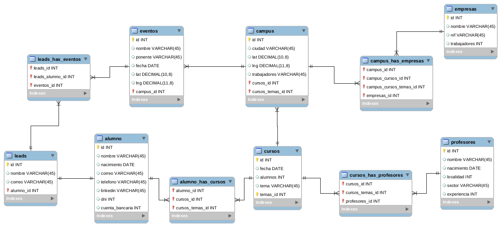
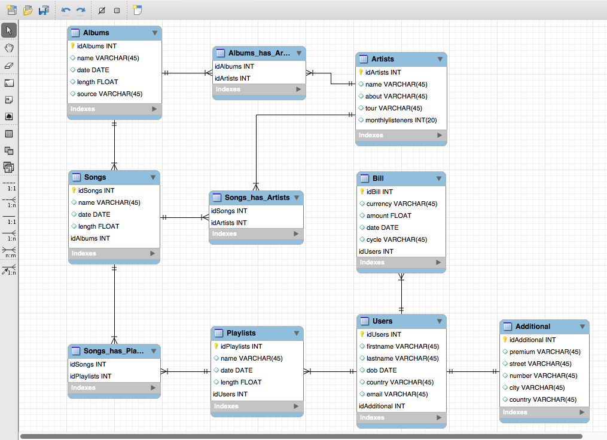

# Day 3, Proyecto SQL - base de datos para AMAZON
## Paso 1
Creo la base de datos para AMAZON. Las entidades son:  
Users, Reviews, Products, Productsdelivery y Productowners  
En la imagen se incluyen las relaciones entre los diferentes diagramas.  

## Paso 2
Configuro las relaciones. 
Relaciones One to One: 
    Users con Productowners  
Relaciones One to Many:  
    Productsowners con Productsdelivery 
    Productsowners con Products 
    Products con Reviews 
Relaciones Many to Many: 
    Users con Reviews 
    Products con Productsdelivery 
Exportamos como SQL script as iteration2.sql
## Paso 3
Añado la entidad Billinginfo con los siguientes attributos: 
    name, lastname, adress, city, country, zip, contactphone, bankaccount 
Esta entidad se relaciona con Users con una conexion One to One 
Exportamos como SQL script as iteration3.sql
## Paso 4
Creo que el resultado final está normalizado 
Adjunto figura final de la base de datos: 
